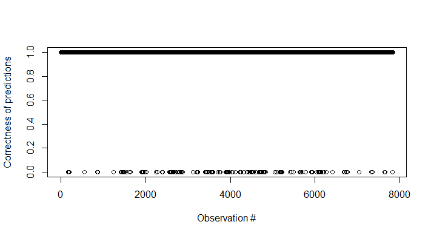
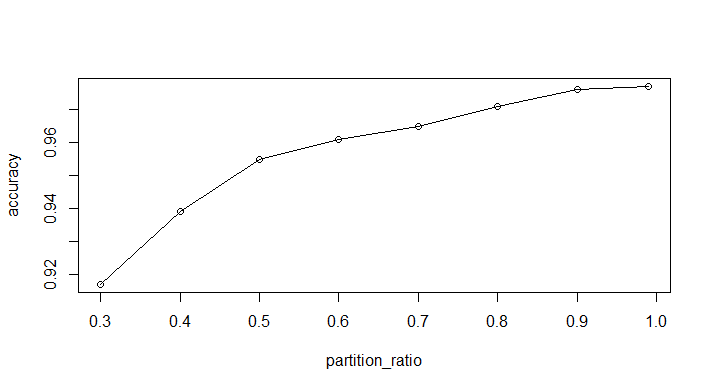
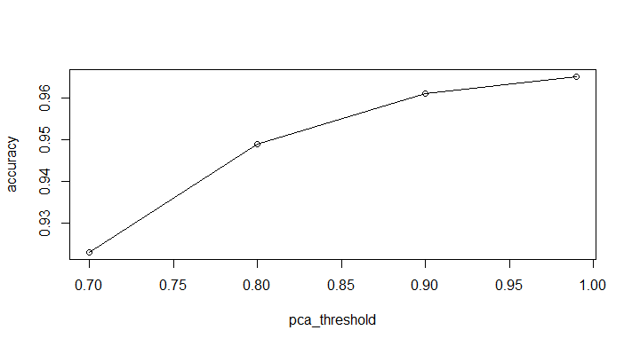

# Practical Machine Learning: Course Project Report
========================================================

### Problem statement
Using devices such as Jawbone Up, Nike FuelBand, and Fitbit it is now possible to collect a large amount of data about personal activity relatively inexpensively. These type of devices are part of the quantified self movement - a group of enthusiasts who take measurements about themselves regularly to improve their health, to find patterns in their behavior, or because they are tech geeks. One thing that people regularly do is quantify how much of a particular activity they do, but they rarely quantify how well they do it. In this project, your goal will be to use data from accelerometers on the belt, forearm, arm, and dumbell of 6 participants. They were asked to perform barbell lifts correctly and incorrectly in 5 different ways. More information is available from the website here: http://groupware.les.inf.puc-rio.br/har (see the section on the Weight Lifting Exercise Dataset).

The goal of your project is to predict the manner in which they did the exercise. This is the "classe" variable in the training set. You may use any of the other variables to predict with. You should create a report describing how you built your model, how you used cross validation, what you think the expected out of sample error is, and why you made the choices you did. 

### Our detailed solution
In summary, our solution performed very well. We were able to obtain about a 96% accuracy on the cross-validation set. Furthermore, we were able to pass all the 20 test cases. The CARET and KERNLAB packages were extremely useful for this project. In the following, we detail the ste-by-step procedure adopted to solve this practical machine learning problem.

1. The gym training data consists of 19622 observations of 160 variables. Using a partition factor of 0.6, we split this into a training set (11775 observations) and a cross validation set (7847 observations). The idea is to train on the training set, and perform error analysis on the cross-validation set.

2. Since 160 is a large number of variables to deal with, we first perform a NearZeroVar() operation to remove all the variables with zero or very low variances. In some sense, these variables do not provide much information. After this operation, we were able to bring down the variable count to 107.

3. We next removed the timestamps-related variables, the variable X and also the user names (given 6 different people, that is also a low variance (~1/6) variable). This brings down the number of useful variables to 102.

4. The next important step is to perform a PCA analysis using the preProc() function. By setting a PCA threshold of 0.95, we were able to retain most of the variance with only 36 variables. These 36 variables form our 'predictors' and the classe variable is out 'outcome'. Given the density of NA variables in the data, we also used the "knnImpute" function to impute the data.

5. We used the train() function to train the data.
  * At first attempt, we only used a generalized linear model (glm) to fit the data. With this, we noticed that the prediction accuracy was as low as 55% on the cross-validation set.
  * Noting that the "glm" method works poorly for classification problems, we proceeded to use the random forest ("rf") technique of fitting data. In order to shorten the simulation time, we used the following control option on the training set: 'trControl=trainControl(method="cv",number= 2)'.
  This provided a nice balance between simulation time and accuracy. The final step was to predict the fit model's performance on the cross-validation data.

6. The performance of our algorithm as displayed by the confusionMatrix() function is presented below. As established by the accuracy metric, it does very well. 

```
Confusion Matrix and Statistics

          Reference
Prediction    A    B    C    D    E
         A 2192   21    8    7    4
         B   43 1418   37    4   16
         C    7   28 1314   16    3
         D    4    3   61 1215    3
         E    1    6   20   17 1398

Overall Statistics
                                          
               Accuracy : 0.9606          
                 95% CI : (0.9561, 0.9648)
    No Information Rate : 0.2864          
    P-Value [Acc > NIR] : < 2.2e-16       
                                          
                  Kappa : 0.9502          
 Mcnemar's Test P-Value : 4.338e-10       

Statistics by Class:

                     Class: A Class: B Class: C Class: D Class: E
Sensitivity            0.9755   0.9607   0.9125   0.9651   0.9817
Specificity            0.9929   0.9843   0.9916   0.9892   0.9931
Pos Pred Value         0.9821   0.9341   0.9605   0.9448   0.9695
Neg Pred Value         0.9902   0.9908   0.9805   0.9933   0.9959
Prevalence             0.2864   0.1881   0.1835   0.1605   0.1815
Detection Rate         0.2794   0.1807   0.1675   0.1549   0.1782
Detection Prevalence   0.2845   0.1935   0.1744   0.1639   0.1838
Balanced Accuracy      0.9842   0.9725   0.9520   0.9771   0.9874
```
Figure 1 plots correctness of predictions versus the observed case.


**Figure 1** Plot depicting the incorrect cases

### Discussion
For completeness, We also study how the data partitioning as well as the PCA affect the algorithm accuracy.

Figure 2 plots accuracy on the cross validation set versus the partition ratio and shows that a factor of 0.6 yields a close-to-optimal performance. This is also the case that offers a reasonably good trade-off between accuracy and computation time as well.


**Figure 2** Accuracy versus the partition ratio.

Figure 3 plots accuracy on the cross validation set versus the PCA threshold and shows that a factor of 0.9 yields a close-to-optimal performance. Increasing the PCA threshold further does better but is also more computationally complex since the predictors dimensionality increases.


**Figure 3** Accuracy versus the PCA threshold.

### Appendix: Source Code
The code used for the course project is presented below
```
rm(list=ls()) #clear all variables in workspace

# Gym data exercise
library(caret)
library(kernlab)

# Load training data
gymData = read.csv('pml-training.csv')
# Partition into training and cross-validation data
trainingIndex = createDataPartition(gymData$classe,p=0.6,list=FALSE)

# Training and Cross-validation data
trainingData = gymData[trainingIndex,]
CVData = gymData[-trainingIndex,]

# Remove near-zero variance variables
nsv = nearZeroVar(trainingData)
trainingData = trainingData[,-nsv]
CVData = CVData[,-nsv]

# Remove timestamp variables, user name and X since we feel as they are not useful
trainingData = trainingData[,-c(1:5)]
CVData = CVData[,-c(1:5)]

pca_thresh = 0.95 # PCA threshold
# Last few cols  is the "classe" varable. We remove them and do a pca analysis
# We also perform k-nearest neighbor imputation in parallel
preProc = preProcess(trainingData[-ncol(trainingData)],method=c("knnImpute","pca"),thresh=pca_thresh)

# Determine fit coefficients on train data
trainingPC = predict(preProc,trainingData[-ncol(trainingData)])
modelFit = train(trainingData$classe~.,method="rf",data=trainingPC,trControl=trainControl(method="cv",number= 2))

###############################################
# Determine accuracy on CV data
CVPC = predict(preProc,CVData[-ncol(CVData)])
CVPrediction = predict(modelFit,CVPC)
print(confusionMatrix(CVData$classe,CVPrediction))

###############################################
# Predict on test set
testData = read.csv("pml-testing.csv")
# Remove irrelevant columns
testData = testData[-c(nsv,1:5)]
testPC = predict(preProc,testData[-ncol(testData)])
testPredictions = predict(modelFit,testPC)

###############################################
# Writing predictions to a file
pml_write_files = function(x){
  n = length(x)
  for(i in 1:n){
    filename = paste0("problem_id_",i,".txt")
    write.table(x[i],file=filename,quote=FALSE,row.names=FALSE,col.names=FALSE)
  }
}
# pml_write_files(testPredictions) # uncommment for writing out to files
```